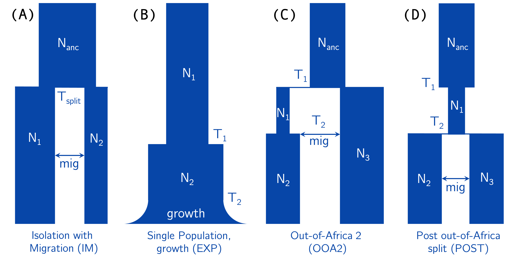
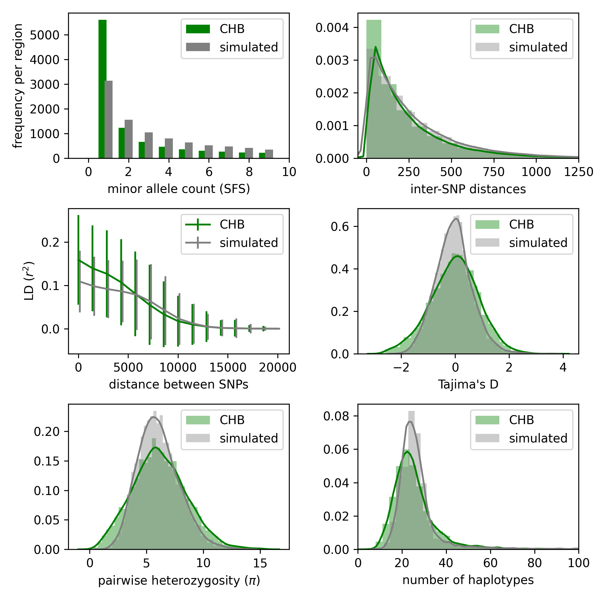
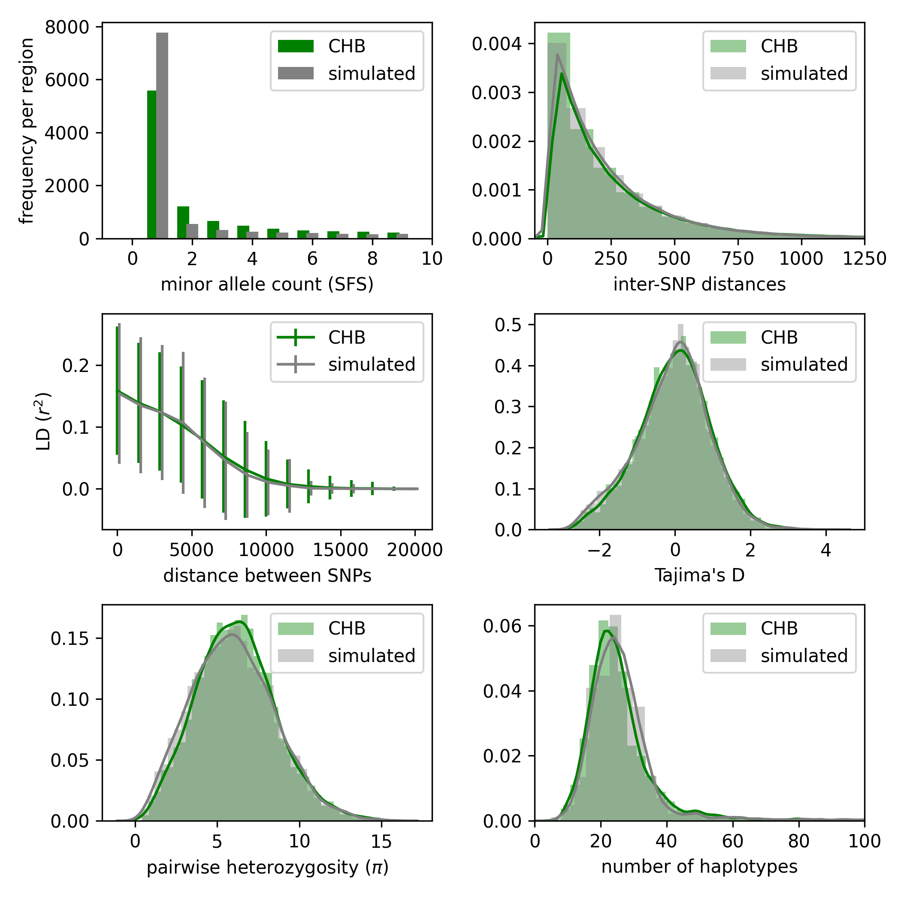

# pg-gan

This software can be used to create realistic simulated data that matches real
population genetic data. It implements a GAN-based algorithm (Generative Adversarial Network)
described in the paper [Automatic inference of demographic parameters using Generative Adversarial Networks](https://onlinelibrary.wiley.com/doi/10.1111/1755-0998.13386).

Python 3.6 (or later) is required, along with the following libraries (these exact versions are likely not necessary, but should be similar):

~~~
msprime==0.7.4
numpy==1.17.2
tensorflow==2.2.0
~~~

See the [msprime documentation](https://msprime.readthedocs.io/en/stable/index.html) and
[tensorflow pip guide](https://www.tensorflow.org/install/pip) for installation instructions.

Dependencies for pre-processing real data (not needed to try out the first two simulation command lines below):

~~~
h5py==2.10.0
~~~

Link: [HDF5 for Python](https://www.h5py.org/)

Dependencies for creating summary statistic plots:

~~~
allel==1.2.1
~~~

Link: [scikit-allel](https://scikit-allel.readthedocs.io/en/stable/)

## Demographic models

There are currently six demographic models implemented in `pg-gan` (see below for information about adding your own model). Use the `-m` flag
to specify the model (required parameter).

* CONST (command line `const`): constant population size (Ne)
* IM (command line `im`): isolation-with-migration (two-population model)
* EXP (command line `exp`): one-population exponential growth model
* OOA2 (command line `ooa2`): Out-of-Africa model with two populations (e.g. YRI/CEU or YRI/CHB)
* POST (command line `post_ooa`): post Out-of-Africa split with two populations (e.g. CEU/CHB)
* OOA3 (command line `ooa3`): three-population Out-of-Africa model (e.g. YRI/CEU/CHB), as specified in [Gutenkunst et al 2009](https://journals.plos.org/plosgenetics/article?id=10.1371/journal.pgen.1000695) and implemented in [stdpopsim](https://elifesciences.org/articles/54967).

See the diagram below for the parameters of IM, EXP, OOA2, and POST. Mutation (`mut`) and recombination (`reco`) can also be added to
the list of parameters to infer.

## Simulated training data

Below are two examples with *simulated* training data. In this case the training data is simulated under fixed parameter values (see the manuscript link above for details). Then `pg-gan` attempts to infer these "true" values.

Note that all output is printed to stdout, including current parameter estimates and GAN confusion. If you save this output to a file, it
can then be read in by the summary statistic visualization program.

1. Toy example with simulated training data. `-m im` means use the IM model (isolation-with-migration) and
`-p` is used to specify the parameters to infer (six here). `-t` is the "toy" flag, which will run the method without discriminator
pre-training and then for two iterations only. It should take about 5 min with a GPU.

~~~
python3 pg_gan.py -m im -p N1,N2,N_anc,T_split,reco,mig -t
~~~

  The last two lines of the output contain:

  * A list of all parameter sets throughout training. The last set is used as the final inference. For example in this case the parameters values are:
  [7.118372774235415e-08, 4762.012023755695, 12480.088492825884, 0.061209667268172285, 1614.4605003581084, 20970.075968181205], although yours will be different.

  * A list of all generator loss values throughout training. In this case I obtained [6.124907, 4.915148, 2.7859032] (loss at the beginning as well as the loss after the two iterations). This is good since the
  loss is decreasing as the generator starts to move toward more realistic parameters (although two iterations will not get very far).

2. Same example above but without the "toy" flag. This will take several hours to run (likely 5-6 with a GPU, more
    without one).

~~~
python3 pg_gan.py -m im -p N1,N2,N_anc,T_split,reco,mig
~~~

## Real training data

Below is a tutorial that explains how to run `pg-gan` on the 1000 Genomes data. Modifications may be needed for other data, but the process
should generally be similar.

Note: this tutorial will require [bcftools](http://samtools.github.io/bcftools/bcftools.html).

1. Download the Phase 3 `ALL` VCF files from the [1000 Genomes Project](https://www.internationalgenome.org/data) for chromosomes 1-22. Also download
the accessibility mask `20120824_strict_mask.bed`.

2. Identify a set of samples for the population of interest. Here we will use CHB, and a sample file is provided above in `prep_data/CHB_gan.txt`.
When using more than one population, make sure the samples are sorted by population (and currently equal numbers from each population are needed). Data from all populations eventually needs to end up in the same VCF file and then the same HDF5 file.

3. Create a list of VCF files to use as training data. Here we will use chromosomes 1-22 from CHB, and the list of files is provided in `prep_data/CHB_filelist.txt`.

4. Prepare the VCF files using `bcftools`. This will remove non-segregating sites and multi-allelic sites, as well as retain our desired samples and concatenate chromosomes 1-22 into one VCF file. To do all these operations, use the file `prep_data/prep_vcf.sh`.

~~~
sh prep_data/prep_vcf.sh
~~~

5. Convert this final VCF file into HDF5 format:

~~~
python3 vcf2hdf5.py -i CHB.phase3_shapeit2_mvncall_integrated_v5a.20130502.genotypes.vcf.gz -o CHB.phase3_shapeit2_mvncall_integrated_v5a.20130502.genotypes.h5
~~~

6. Finally, run `pg-gan` on the data using (for example) a 5-parameter exponential growth model.

~~~
python3 pg_gan.py -m exp -p N1,N2,growth,T1,T2 -d CHB.phase3_shapeit2_mvncall_integrated_v5a.20130502.genotypes.h5 -b 20120824_strict_mask.bed
~~~

Use `-r` (optional) to specify a folder with recombination map files for each chromosome (for example `-r genetic_map/`). This will cause the generator to sample from this recombination rate distribution when creating simulated data. See the start of file `genetic_map_GRCh37_chr1.txt` below for the
format of the recombination map files.

~~~
Chromosome      Position(bp)    Rate(cM/Mb)     Map(cM)
chr1    55550   2.981822        0.000000
chr1    82571   2.082414        0.080572
chr1    88169   2.081358        0.092229
chr1    254996  3.354927        0.439456
...
~~~

## Visualizing summary statistics

After running `pg-gan`, the resulting parameters can be used to simulate data, which can then be compared to the real data via summary statistics. For example, to reproduce (roughly) the figures below, run the following commands:

~~~
python3 pg_gan.py -m const -p Ne -d CHB.phase3_shapeit2_mvncall_integrated_v5a.20130502.genotypes.h5 -b 20120824_strict_mask.bed -r genetic_map/ > chb_const.out

python3 summary_stats.py chb_const.out chb_const.png
~~~

The second command with `summary_stats.py` generates a plot (similar to the one below). The input file is `chb_const.out` and the output file is `chb_const.png`.

Here is another example with the EXP model instead of CONST:

~~~
python3 pg_gan.py -m exp -p N1,N2,growth,T1,T2 -d CHB.phase3_shapeit2_mvncall_integrated_v5a.20130502.genotypes.h5 -b 20120824_strict_mask.bed -r genetic_map/ > chb_exp.out

python3 summary_stats.py chb_exp.out chb_exp.png
~~~

### Aside: Testing/customization in Summary Stats
By default, `summary_stats` will use the same arguments used in the input file, but command line arguments can be used to override the original settings if desired -- usually for testing purposes.
`python3 summary_stats.py chb_const.out chb_const.png -b alternate_mask.bed`
Additionally, in some situations (usually testing), it may be desirable to not read from an input file at all, and instead use a static set of arguments and parameters. This can be arranged with the file `global_vars.py`, `section B: overwriting in-file data`. Set the variable `OVERWRITE_TRIAL_DATA = True`, and then adjust the dictionary `TRIAL_DATA` as needed.
~~~
# section B: overwriting in-file data-------------------------------------------
OVERWRITE_TRIAL_DATA = True
TRIAL_DATA = { 'model': 'const', 'params': 'Ne', 'data_h5': 'CHB.phase3_shapeit2_mvncall_integrated_v5a.20130502.genotypes.h5',
               'bed_file': '20120824_strict_mask.bed', 'reco_folder': 'genetic_map/', 'param_values': '10000.'}
~~~
The program will ignore the given input file, and instead use the arguments provided in `global_vars.py`. As before, any command line arguments provided will override those from the file.
`python3 summary_stats.py ignore_file.out sample.png`

The `global_vars.py` file also allows customization of the population labels and colors used by `summary_stats` in `section C: summary stats customization`. It is recommended to comment out the body of the function `update_ss_labels` (leaving the assert statement at the end of the definition,) then to add your own custom labels and colors at the end of the function definition. Be sure to always use the `extend` or `append` methods to mutate the lists, instead of overwriting the lists (which will silently fail.) For example:
~~~
  ...
  # after commenting out the body of update_ss_labels...
  SS_LABELS.extend(["sample_A", "sample_B"])
  SS_COLORS.extend(["red", "blue"])

  assert len(SS_LABELS) == len(SS_COLORS) # leave this assert at the end
~~~
You can also edit the `COLORS_DICT` variable on at the beginning of section C to contain your population name and its corresponding color.

## Creating your own models

You can add your own demographic models to `pg-gan`, as long as they are implemented in `msprime`. Right now new models must be added as functions
to `simulation.py`. Each function should return an `msprime` tree sequence. Here is an example for the CONST model. The `params` should match
those in the `util.py` file (although more can be added as needed), and the `sample_sizes` should be a list of integers (with length matching the number
  of populations). The other parameters of the function can be ignored unless the user wants to customize them.

~~~
def simulate_const(params, sample_sizes, seed, reco):
    assert len(sample_sizes) == 1

    # simulate data
    ts = msprime.simulate(sample_size=sum(sample_sizes), Ne=params.Ne.value, \
        length=global_vars.L, mutation_rate=params.mut.value, recombination_rate=reco, \
        random_seed = seed)

    return ts
~~~

After adding this function, register it in the `process_opts` function of `util.py` as a new option. For one-population models use the `OnePopModel`
discriminator, for two-population models use `TwoPopModel`, and for three-population models use `ThreePopModel`. The `sample_sizes` variable
should be a list of integers matching the number of haplotypes in each population. If the distribution of haplotypes is even between the populations, the internal function `get_sample_sizes` can be used. In this case, be sure to either specify the total number of samples with the command argument flag `-n`, or in `global_vars.DEFAULT_SAMPLE_SIZE` (see aside.)

~~~
if opts.model == 'const':
    sample_sizes = get_sample_sizes(num_pops = 1) # [198]
    discriminator = discriminators.OnePopModel() if not summary_stats else None
    simulator = simulation.simulate_const
~~~
### Aside: Further customization
It is sometimes desirable to use a longer region length, a smaller batch size, a different default sample size, etc. These values and more can be overwritten in the `global_vars.py`, `section A: general`:
~~~
# section A: general -----------------------------------------------------------
...
L = 50000
BATCH_SIZE = 50
DEFAULT_SAMPLE_SIZE = 198
...
~~~
Changes made in the `global_vars.py` file will be used in the entire program (it is recommended to keep values consistent between runs of the `pg_gan` and `summary_stats`, as it will not check the same global variable values were used.) Read through the rest of `global_vars.py` for more customization options.

## General notes

We recommend running `pg-gan` 10 times, then selecting the run with the lowest discriminator accuracy on *generated* data (i.e. which run produces data that is most easily confused for real data). If any runs result in a discriminator that always predicts the same class (either all real or all simulated), reject the run.

`pg-gan` is under active development. Please reach out to Sara Mathieson (smathieson [at] haverford [dot] edu) with any questions.
